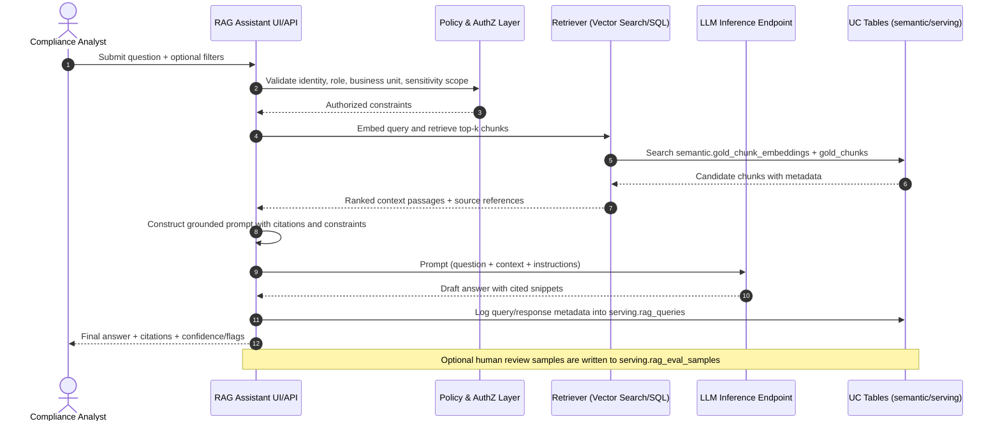

# Architecture

This project implements a medallion-style Lakehouse architecture for regulatory document intelligence on Databricks.

## End-to-end data flow

The canonical flow is:

**Sources → Bronze (raw documents) → Silver (extracted + normalized) → Gold (chunks + embeddings + analytics) → RAG serving**.

1. **Sources**: Policy repositories, contract systems, file drops, email attachments, and scanned document feeds.
2. **Bronze (`raw`)**: Immutable landing layer for raw binaries and ingestion metadata.
3. **Silver (`curated`)**: Parsed text, OCR outputs, structure extraction, normalization, and quality checks.
4. **Gold (`semantic`)**: Semantically useful artifacts including chunked text, vector embeddings, and document-level analytics.
5. **RAG serving (`serving`)**: Query orchestration, retrieval, prompt assembly, answer generation, and trace/evaluation logging.

## DLT pipelines

Two Delta Live Tables (DLT) pipelines partition responsibilities and simplify operations.

### 1) Ingestion + extraction pipeline (Bronze → Silver)

**Purpose**
- Land files from source systems.
- Capture provenance metadata.
- Extract text and document structure.
- Normalize metadata and enforce data quality expectations.

**Typical outputs**
- `raw.bronze_documents`
- `curated.silver_documents`
- `curated.silver_document_pages`
- `curated.silver_document_sections`

### 2) Chunking + embeddings + analytics pipeline (Silver → Gold)

**Purpose**
- Split normalized text into retrieval-ready chunks.
- Create embeddings for each chunk.
- Compute document analytics and governance tags.
- Publish serving-ready semantic tables.

**Typical outputs**
- `semantic.gold_chunks`
- `semantic.gold_chunk_embeddings`
- `semantic.gold_doc_analytics`

## Unity Catalog layout

All datasets are managed in Unity Catalog catalog **`regdoc_intel`** with the following schemas:

- **`raw`**: Raw landing/immutable ingestion data.
- **`curated`**: Standardized extraction outputs.
- **`semantic`**: Chunk, embedding, and analytics assets.
- **`governance`**: Policy rules, taxonomy, lineage, and audit dimensions.
- **`serving`**: Query logs, evaluation samples, and application-facing views/tables.

## Query sequence for the RAG assistant

